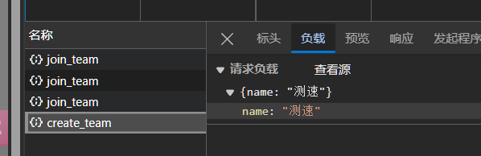
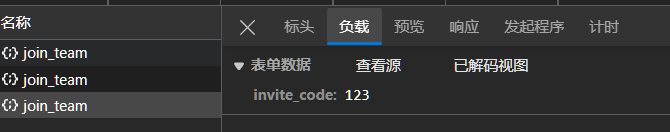

# 环境配置

默认采用 conda 进行 Pyhton 虚拟环境管理，请提前配好 conda 环境

1. **创建 Python 虚拟环境**

```bash
conda create -n aigame python=3.12
conda activate aigame
```

如果是在 windows 上使用 conda，可能会遇到 `conda activate` 无效问题，请查看此[链接](https://blog.csdn.net/u010393510/article/details/130715238)解决

2. **下载 Python 依赖**

```bash
git clone https://github.com/SYSUMSC/aigame.git
cd aigame

pip config set global.index-url https://pypi.tuna.tsinghua.edu.cn/simple
pip install -r requirements.txt
```

3. **运行**

```bash
cd app
python main.py
```

接着在本地浏览器打开 `localhost:8000/admin` 路径，开发默认账号是 **admin**，密码是 **123456**

后台API文档地址`localhost:8000/docs`

# 赛题模板

点此处跳转至[赛题模板文档](task/README.md)

# 路径说明

```
|-app #fastapi后台
|---admin #admin后台，采用layuiadmin框架开发
|-----static
|-------adminui
|---------dist
|-----------css
|-----------modules
|-------layui
|---------css
|---------font
|-------modules
|---------layim
|-----------res
|-------------html
|-------------images
|-------------skin
|-------------voice
|-------style
|---------imgs
|-----------template
|-----templates
|-----router.py
|---api #api，采用fastapi+sqlmodel
|-----admin
|-------auth.py
|-------competition.py
|-------problem.py
|-------router.py
|-------team.py
|-------user.py
|-----user
|-------auth.py
|-------info.py
|-------router.py
|-------team.py
|-----deps.py
|-----exception_handler.py
|-----response_model.py
|---core #定义一些辅助函数
|-----__init__.py
|-----config.py
|-----security.py
|-----utils.py
|---db #定义数据库连接器
|-----session.py
|---middleware #定义鉴权工具
|-----auth_middleware.py
|---schemas #定义数据库模型和api模型
|-----__init__.py
|-----competition.py
|-----config.py
|-----problem.py
|-----team.py
|-----user.py
|---main.py #启动文件
```

# 开发说明

## 前台前端开发说明

采用ts+vue3+pinia+tailwind+bootstrap5+pnpm

### 初始化环境

```
cd frontend
pnpm i
```

运行则输入`pnpm dev`


## 后台前端开发说明

采用layuiadmin,layui官网：[开始使用 - Layui 文档](https://layui.dev/docs/2/)

对于一个数据模型， 主要包含增删改查，

- 增改，通过table页面点添加或者编辑，打开form页面

- 删查，在table页面进行，支持单个删除，整体删除，查询

推荐使用vscode `aide`插件，复制app/admin,app/schema给ai，就可以快速让ai写出来增删改查页面

### 导航

在`template/index.html`修改具体url

### table页面

以`user.html`为例子

创建在template，大概只需要改title和header要查询的字段，然后extra_js改具体url，比如队伍就是team的；以及修改table.render的col字段，定义显示什么

```html


  用户管理



  {{ search_field('用户名', 'username', '请输入用户名') }}
  {{ search_field('邮箱', 'email', '请输入邮箱') }}
  {{ search_field('学号', 'student_id', '请输入学号') }}



  <script>
    layui
      .config({
        base: '/admin/static/' // 静态资源所在路径
      })
      .use(['index', 'table', 'laytpl', 'admin'], function () {
        //省略
  </script>


```

在`router.py`定义路由

```python
@admin_router.get("/admin/user")
async def user(request: Request):
    return templates.TemplateResponse("user.html", {"request": request})
```


### form页面

以`user_form.html`为例子

创建在template

```html


  用户管理-表单


    
    {{ input_field('用户名', 'username', '请输入用户名', required=True) }}
    {{ input_field('姓名', 'name', '请输入姓名', required=True) }}
    {{ input_field('邮箱', 'email', '请输入邮箱', 'email', required=True) }}
    {{ select_field('状态', 'status', [{'value': 'active', 'label': '激活'}, {'value': 'inactive', 'label': '未激活'}], required=True) }}


```

根据`form_macros`定义的宏，类似调用函数来构建表单，减少重复代码

在`router.py`定义路由

```python
async def user_form(request: Request):
    return templates.TemplateResponse("user_form.html", {"request": request})
```


## 后端API开发说明

在 `/app/api` 定义了 `admin` 与 `user` 的后端API，通过 `router.py` 结合不同的路由

鉴权通过中间件 `app\middleware\auth_middleware.py` 要求请求`header`或者`json body`包含`access_token` 目前比较混乱

### 前台API开发说明

数据结构定义在 `app\schemas`，通过`SQLModel`封装，无需手动写`sql`

#### 传递参数方式

##### json body

后端

（其实更好的做法应该类似后台那样先定义接收模型，而不是用`await request.json()`接收，这里偷懒了）

```python
@team_router.post("/create_team", response_model=ResponseModel, tags=["User"])
async def create_team(request: Request, current_user: str = Depends(get_current_user), session: AsyncSession = Depends(get_session)):
    try:
        body = await request.json()
        name = body.get("name")
```

前端

```js
const res = await axios.post("/api/user/create_team", {
  name: newTeamName.value,
});
```

前端负载为json



##### form参数

后端

```python
async def join_team(invite_code: str = Form(...), current_user: str = Depends(get_current_user), session: AsyncSession = Depends(get_session)):
```

前端

常规应该是提取form的内容，然而这里没有实际的form所以要先创建form对象

```js
const formData = new FormData();
formData.append("invite_code", inviteCode.value);
const res = await axios.post("/api/user/join_team", formData, {
  headers: {
    "Content-Type": "multipart/form-data",
  },
});
```
负载会显示表单数据


#### get参数


早期join_team如下

`invite_code` 没有指定`Form`类型，所以是get参数

```python
async def join_team(invite_code: str, current_user: str = Depends(get_current_user), session: AsyncSession = Depends(get_session)):
```

url中`?`后面的都是get参数

```js
const res = await axios.post(`/api/user/join_team?invite_code=${encodeURIComponent(inviteCode.value)}`)
```

### 后台API开发说明

数据结构定义在 `app\schemas`，通过`SQLModel`封装，无需手动写`sql`

主要是对数据表的增删改查， 比如`user.py`就是对`app\schemas\user.py`的增删改查

数据传输通过`POST` `json`

在 `app\schemas\user.py` 定义的 `UserSchema` 用于 增加，修改 需要传递的参数

在 `app\schemas\user.py` 定义的 `UserSearchSchema` 用于 搜索（查找） 需要传递的参数

一个提交post json的例子，主要是设置`contentType` 和 `data`记得`JSON.stringify`

```js
$.ajax({
  url: "/api/admin/",
  method: "POST",
  contentType: "application/json;charset=UTF-8",
  data: JSON.stringify({ ids: ids }),
  success: function (res) {
  },
});
```

# 格式化 import

```
python -m isort .
```

美化jinja html

```
d:\ProgramData\miniconda3\envs\newaigame\python.exe -m pip install -U djlint --target D:\ProgramData\miniconda3\envs\newaigame\Lib\site-packages
```


fastcrud文档：https://igorbenav.github.io/fastcrud/

SQLModel文档：https://sqlmodel.fastapi.org.cn/

接口说明，返回json，有字段code 0正常，1异常,msg中文消息,data=数据（可能没有）,count数据总长度，是分页前的总长度（可能没有）

错误返回的http码仍是200，只是code变为1，msg为异常原因，禁止使用返回接口raise HTTPException(status_code=404, detail="错误")

后台对于一个表，通常有的操作有

- 新增，修改（传入id），根据ModelSchema字段进行添加

- 删除（传入id），批量删除（传入ids，`,`分割）

- 查询
    post参数根据ModelSearchSchema的字段进行查询，如果是int则=匹配，如果是str则like % %匹配
    get参数为page，limit

- 使用json body传参（后台layuiadmin需要修改）

    ```
                      contentType: "application/json;charset=UTF-8",
                      data: JSON.stringify(field),
    ```


# vscode拓展

admin相关

- Jinja2 Snippet Kit
- Better Jinja
- djlint